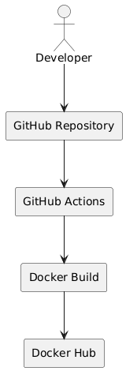
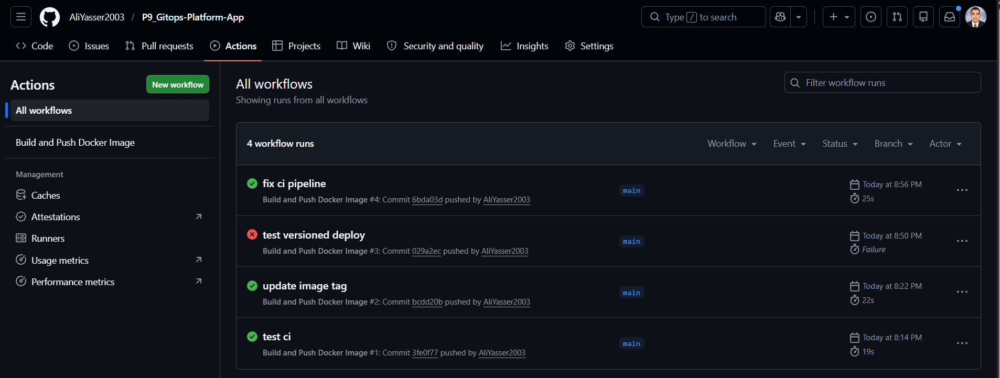
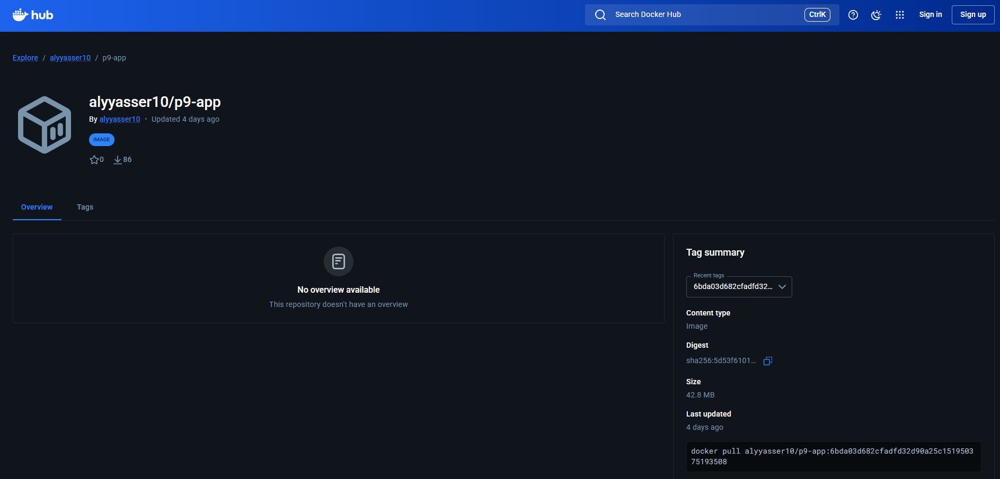

# GitOps Platform – Application Repository

This repository contains the application source code and CI pipeline for a GitOps-based Kubernetes deployment workflow.
The project uses GitHub Actions to automatically build and push Docker images to Docker Hub after every push to the main branch.

## Tech Stack

- Node.js
- Docker
- GitHub Actions

## CI Pipeline Flow

## Workflow Overview

1. Developer pushes code to GitHub
2. GitHub Actions workflow starts automatically
3. Docker image is built
4. Image is pushed to Docker Hub
5. Deployment repository is updated with the new image tag

## Docker Image

Docker Hub Repository:
https://hub.docker.com/r/alyyasser10/p9-app

## Features

- Automated Docker image builds using GitHub Actions
- SHA-based image versioning
- Docker image publishing to Docker Hub
- Integration with GitOps deployment repository
  

## Screenshots

### GitHub Actions Pipeline

### Docker Hub Image

## Related Repository
Deployment Repository:
https://github.com/AliYasser2003/P9_Gitops-Platform-Deploy
